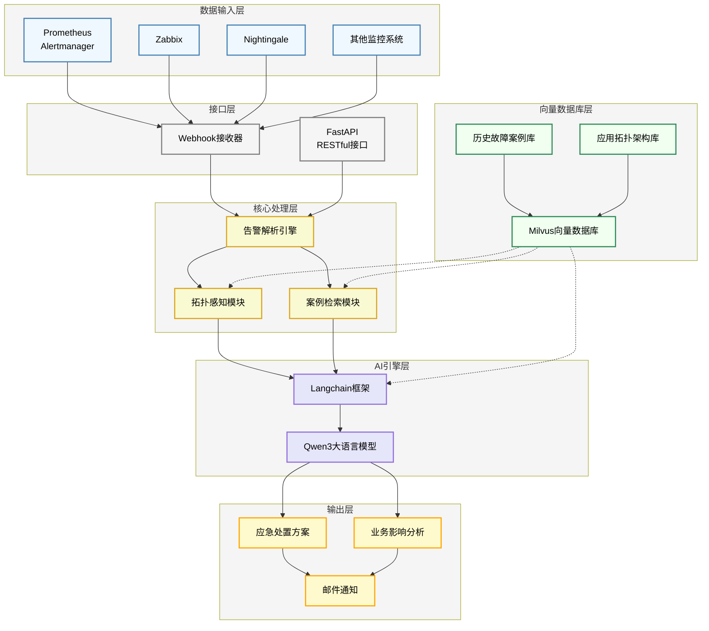

# SRE Copilot AI智能运维助手

## 📖 项目概述
SRE Copilot是一个基于Langchain框架构建的AI智能助手，专门为公司中运维团队设计。该系统能够基于历史故障案例、应用系统拓扑架构信息和实时告警数据，自动生成针对性的应急处置方案、业务影响分析和影响范围评估。

## 🚀 核心功能
### 1. 智能应急处置方案生成
- 基于历史故障案例库进行相似度匹配
- 结合当前告警上下文生成针对性处置建议
- 提供分步骤的应急操作指南

### 2. 业务影响分析
- 自动识别告警影响的业务系统
- 评估影响范围和严重程度
- 提供业务侧沟通建议

### 3. 应用拓扑架构感知
- 集成应用系统架构信息
- 理解服务依赖关系
- 基于拓扑结构进行影响链分析

### 4. 实时告警处理
- Webhook接入多种监控系统告警
- 实时解析告警信息
- 自动触发应急响应流程

## 🛠️ 技术架构
### 核心框架
- Langchain: AI应用开发框架
- Qwen3: 大语言模型引擎

### 数据存储
- Milvus: 存储历史故障案例，用于相似度检索
  - 历史故障案例库结构, `incidents_cases`:
    - **case_id** (VARCHAR, primary key): 案例唯一标识，如"INC-2024-DATA-001"
    - **title** (VARCHAR): 案例标题，简洁概括故障现象
    - **description** (VARCHAR): 详细的故障描述，包括现象、影响范围等
    - **solution_summary** (VARCHAR): 解决方案摘要，用于向量化表示和快速浏览
    - **severity_level** (INT): 严重等级，P0=0, P1=1，便于排序和过滤
    - **tags** (JSON): 标签数组，用于分类和快速筛选，如：["MySQL", "主从延迟", "数据库"]
    - **problem_vector** (FLOAT_VECTOR): 核心匹配向量，由title+description组合生成，用于与新告警进行相似度匹配
    - **occurred_timestamp** (INT64): 故障发生时间戳，便于时间范围查询和排序
- Neo4j: 存储应用拓扑架构，用于依赖关系分析和影响链分析
  - 应用拓扑架构库结构：
    - **服务节点 (Service Node)**:
      - **service_id** (STRING, primary key): 服务唯一标识，如"svc-dolphinscheduler-batch"
      - **service_name** (STRING): 服务名称，如"DolphinScheduler 批处理调度"
      - **service_type** (STRING): 服务类型，如"scheduler"、"database"、"api"
      - **tags** (LIST OF STRING): 标签数组，如["调度", "离线任务"]
      - **updated_at** (DATETIME): 更新时间
    - **依赖关系 (DEPENDS_ON Relationship)**:
      - **from** (Service Node): 依赖方服务
      - **to** (Service Node): 被依赖方服务

### 接口服务
- FastAPI: RESTful API服务
- Webhook: 告警接收接口

## 🏗️ 项目架构图

## 📦环境要求
- Python 3.12+
- MySQL 8+
- Qwen API密钥

## 🤝 集成支持
### 监控系统集成
- Prometheus Alertmanager
- Zabbix
- Nightingale
- ....

### 通知渠道
- 邮件